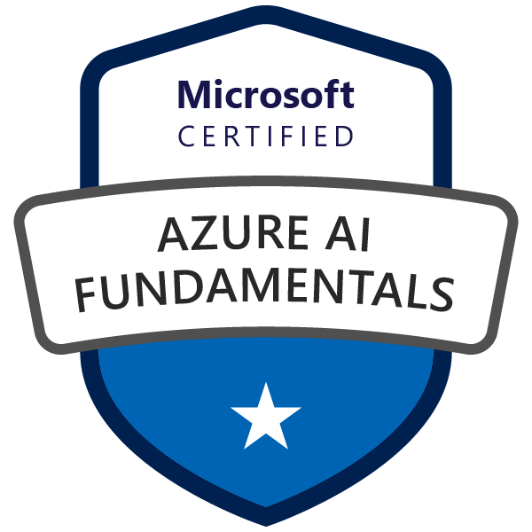
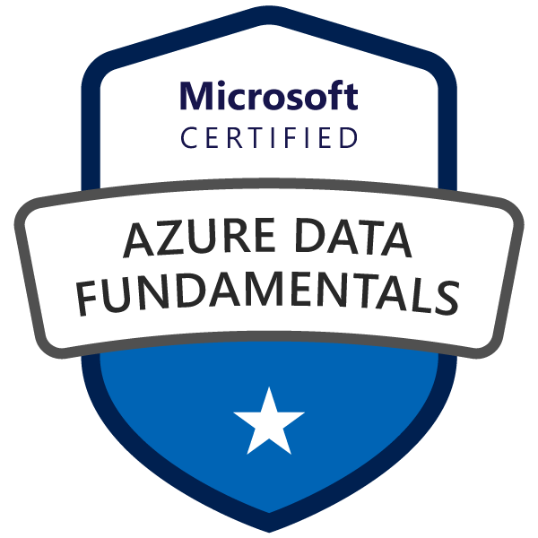
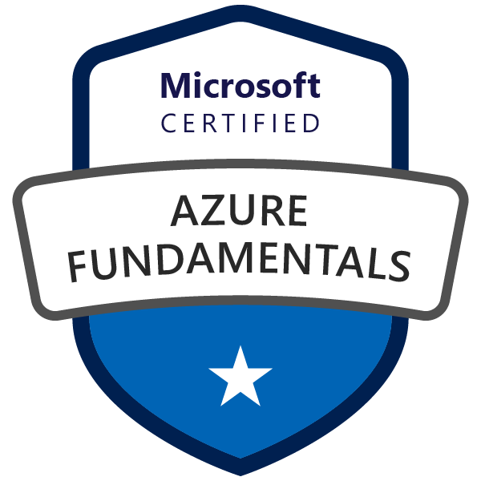
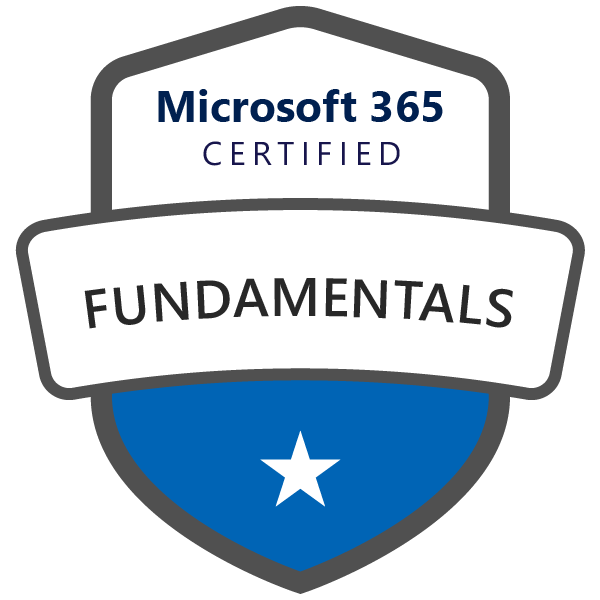

 
### 👋 自己紹介
ようこそ！ボクは将来、人工知能研究をしたい短大二年の理系女子。学校では4年制編入課程に入ってて、あとコンピューターサイエンス学部で TA と チューターしてるで。

そうはいっても広い目で見ると、今の実力はとりあえずエラーなしで動くとこまでやで（笑）

学校の授業でやるような問題や、課外研究のプロジェクトを、参考にした動画やドキュメントへのリンクとともに上げてきます。ボクはどっちかっていうと自作 ㍶ のローカル環境を色々ググりながらやってます。

### ✏️ 使ってる環境はこんな感じです。

>- CPU: *Ryzen ７ 7800 X3D* 
>- Python 3.6.x
>- Tensorflow 2.6.2
>- pip 21.3.1
>- OS は Windows 11 で、エディタはマイクロソフトの VSコード 使ってるで。
>- VS Code
>- Microsoft Visual Studio

### ✍️ 資格ショーケース:
#### Microsoft Certifications:
<a heref="https://www.credly.com/badges/2a99c938-7d3c-4704-ad65-a74f1e7f0b36/public_url" title="to credly.com"></a>
<a heref="https://www.credly.com/badges/6a748ff4-666e-40c8-b42d-f2ce29c592f4/public_url" title="to credly.com"></a>
<a heref="https://www.credly.com/badges/b97c8432-e28b-4664-9ecf-0865806b6555/public_url" title="to credly.com"></a>
<a heref="https://www.credly.com/badges/3b16e1be-dfc7-4903-a315-6b8f618c1e7e/public_url" title="to credly.com"></a>

#### Learn Enough Course Certifications:
<a href="https://www.learnenough.com/certificates/mokubo">
      </a><a
      href="https://www.learnenough.com/certificates/mokubo"></a><a
      href="https://www.learnenough.com/certificates/mokubo"></a><a
      href="https://www.learnenough.com/certificates/mokubo"></a><a
      href="https://www.learnenough.com/certificates/mokubo"></a><a
      href="https://www.learnenough.com/certificates/mokubo"></a><a
      href="https://www.learnenough.com/certificates/mokubo"></a><a
      href="https://www.learnenough.com/certificates/mokubo"></a><a
      href="https://www.learnenough.com/certificates/mokubo"></a>
</div>

### ⭐️ 受賞歴 ⭐️
- Microsoft Cybersecurity Scholar 2024
- [Inspirit AI Ambassador 2023, 2024](https://drive.google.com/file/d/1ZOfwV1No3JxjttuH1vWbzPvDZjQrpmEe/view?usp=drive_link)
- [Inspirit AI Scholar 2021](https://drive.google.com/file/d/1CsAs2mqDwshvz4UylhFMeDHZKUN_3FeN/view?usp=drive_link)


### 🍧 おまけ 1
ちなみにかしこいボクは、スタンフォードと MIT 大学院生がつくった高校生向けのコンピューターサイエンス課外講習の Inspirit AI でアンバサダーしてるので、夏期講習に興味ある方は ↓ の QR コードをスキャンしてな。えっと英語でだからそこんとこちゃんとできるようにしてや！


### 🍧 おまけ 2
みんなが大好き TensorFlow のインストール手順:

最初に、Pythonのパッケージ管理システムであるpipを最新の状態にアップデートするんやで。
```bash
pip install --upgrade pip
```
次に、TensorFlowをインストールするんやで。
```bash
pip install tensorflow
```

AMD Ryzen 系 CPU 向けの TensorFlow は、`tensorflow` ではなく `tensorflow-rocm` パッケージを使うんやで。
```bash
pip install tensorflow-rocm
```
インストールが完了したら、テンソルフローが正しくインストールされたかどうかを確認するために、以下のコードを実行してみるんやで。

他のヴァージョンのテンソルフローを探してる場合はこっちみて。=> 
[ソースからビルドする < Tensorflow](https://www.tensorflow.org/install/source?hl=ja#gpu)


### プロジェクトやインターンシップのお誘いはこちらまでお願いいたします。
meicha3 [at] protonmail.ch